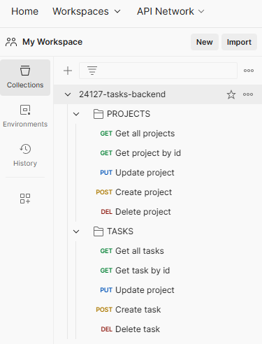

# 24127-task-backend

Example of CRUD API without authentication written in nodejs.

- Entities: `Projects` and `Tasks`
- Components: `database` and `api`

To use the project:

1) Initialize the database
2) Start API
3) Test API

## 1 - Initialize the database [MySQL]

### A. Initialize database using docker

> [!WARNING]
> You need to have `docker` and `docker-compose` installed.

1) Edit the `.env` file

| Variable | Datatype | Description |
| --- | :---: | --- |
| MYSQL_DOCKER_IMAGE | `string` | MySQL version ([see][docker-hub]) |
| MYSQL_DOCKER_CONTAINER_NAME | `string` | Container name |
| MYSQL_DOCKER_RESTART_POLICY | `string` | Container restart policy upon failure ([see][docker-restart-policy]) |
| MYSQL_PORT_EXTERNAL | `number` | _External_ connection port number |
| MYSQL_PORT_INTERNAL | `number` | _Internal_ connection port number |
| MYSQL_ROOT_PASSWORD | `string` | _root_ user password |
| MYSQL_DATABASE | `string` | Database name |
| MYSQL_USER | `string` | Service operator username |
| MYSQL_PASSWORD | `string` | Service operator password |

2) Create database:

```bash
cd database
docker-compose up -d
```

> Once the container is created, the database will also be created using the configuration data from the `.env` file.

### B. Initialize database using another method

1) Connect to the database service (MySQL)
2) Create database:

```bash
CREATE DATABASE mytasks;
```

> [!IMPORTANT]  
> The API configuration data must be updated based on the settings configured in this instance (.env).

## 2 - Start API

### Requirements

> [!WARNING]
> A previously created database is required.

Edit the `.env` file

| Variable | Datatype | Description |
| --- | :---: | --- |
| DB_NAME | `string` | Database name |
| DB_USERNAME | `string` | Service user name |
| DB_PASSWORD | `string` | User password |
| DB_HOST | `string` | Service host name or IP |
| DB_DIALECT | `string` | Dialect  ([see][dialect-specific-sequelize]) |
| DB_PORT | `number` | Port number |
| DB_LOGGING | `boolean` | Logging policy (_true_/_false_) ([see][logging-sequelize]) |
| API_PORT | `number` | API port |

#### Install dependencies

```bash
cd api
npm i
```

#### Configure database

1) Create tables

```bash
cd api/scripts
node create-models.js
```

Upon successful completion of the configuration:

```bash
🔓 Connection has been established successfully.
🌱 Models have been synchronized successfully.
🔒 Connection closed successfully.
```

2) Create test data

```bash
cd api/scripts
node load-data.js
```

Upon successful completion of the test data loading:

```bash
🌱 Task has been created successfully.
```

### Start API

```bash
cd api
npm run dev
```

Once the API has started successfully:

```bash
🚀 API Server Port: XXXX
```

## 3 - Test API

In the `postman` folder, you find an exported collection with the API test commands.

The commands are organized into two folders, one for each entity (`projects` and `tasks`).

Example of imported collection:



### Resources

- [docker](https://docs.docker.com/engine/)
- [docker compose](https://docs.docker.com/compose/)
- [node](https://nodejs.org/docs/latest/api/)
- [npm](https://docs.npmjs.com/)
- [sequelize](https://sequelize.org/docs/v6/)

[docker-hub]: https://hub.docker.com/_/mysql
[dialect-specific-sequelize]: https://sequelize.org/docs/v6/other-topics/dialect-specific-things/
[logging-sequelize]: https://sequelize.org/docs/v7/getting-started/